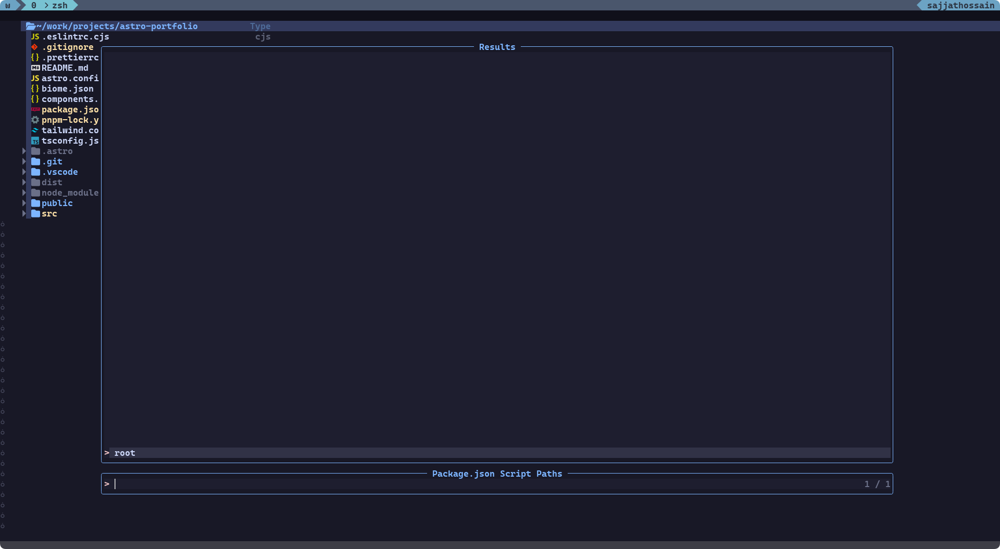

<h1 align="center">Nvim NPM</h1>

<p align="center">A modern Neovim plugin for JavaScript, TypeScript, and Node.js projects. Execute npm/yarn/pnpm/bun scripts seamlessly without leaving your editor.</p>

<p align="center">
  <a href="#features">Features</a> •
  <a href="#screenshots">Screenshots</a> •
  <a href="#installation">Installation</a> •
  <a href="#commands">Commands</a> •
  <a href="#api">API</a> •
  <a href="#default-mappings">Default Mappings</a> •
  <a href="#configuration">Configuration</a> •
  <a href="#health-check">Health Check</a>
</p>

## Features

- 🚀 **Execute npm/yarn/pnpm/bun scripts** without leaving the editor
- 🔧 **Powered by @antfu/ni** - Universal package manager interface
- 🔍 **Auto-detect package manager** (npm, yarn, pnpm, bun) based on lock files
- 📁 **Multi-project support** - works with monorepos and nested projects
- 🎯 **Telescope integration** for fuzzy finding scripts and projects
- 💻 **Terminal management** with toggleterm.nvim integration
- 📦 **Package installation/removal** with interactive package name input
- ⚡ **Smart caching** for better performance
- 🛠️ **Health check** command to verify setup
- 🎨 **Highly configurable** with sensible defaults
- 🔄 **Auto-installation** of ni if not present 

## Screenshots
- Search projects that contain a package.json file


- Show scripts in a telescope window


- execute script


## Installation

Install the plugin with your favorite package manager:

- [vim-plug](https://github.com/junegunn/vim-plug)

```vim
Plug 'sajjahossain/nvim-npm'
Plug 'akinsho/toggleterm.nvim',
Plug 'nvim-telescope/telescope.nvim'
Plug 'rcarriga/nvim-notify'
```

- [packer.nvim](https://github.com/wbthomason/packer.nvim)

```lua
use 'sajjahossain/nvim-npm'
use 'akinsho/toggleterm.nvim',
use 'nvim-telescope/telescope.nvim'
use 'rcarriga/nvim-notify'
```

- [lazy.nvim](https://github.com/folke/lazy.nvim)

```lua
require('lazy').setup({
  {
    'sajjahossain/nvim-npm',
    config = true,
    dependencies = {
      'nvim-telescope/telescope.nvim',
      'akinsho/toggleterm.nvim',
      'rcarriga/nvim-notify',
    }
  }
})
```

## Commands

| Command | Description |
| --- | --- |
| `:ShowScriptsInTelescope` | Shows the available scripts in a telescope window |
| `:OpenTerminal` | Opens one of the available terminals |
| `:InstallPackage` | Installs a package in the current project using ni |
| `:RemovePackage` | Removes a package from the current project using ni |
| `:RefreshPackageJsonCache` | Refreshes the package.json cache |
| `:ExitTerminalSession` | Exits the selected terminal session |
| `:ExitAllTerminalSession` | Exits all terminal sessions |
| `:PrintScripts` | Prints package.json scripts paths (debug) |

## API

| Function | Description |
| --- | --- |
| `require('nvim-npm').showScripts()` | Shows the available scripts in a telescope window |
| `require('nvim-npm').openTerminal()` | Opens one of the available terminals |
| `require('nvim-npm').installPackage()` | Installs a package in the current project using ni |
| `require('nvim-npm').removePackage()` | Removes a package from the current project using ni |
| `require('nvim-npm').exitTerminal()` | Closes the selected terminal |
| `require('nvim-npm').exitAllTerminal()` | Closes all the terminals |


## Default Mappings

| Mode | Key | Action |
| --- | --- | --- |
| Normal | `;pi` | Installs a package in the current project |
| Normal | `;pl` | Lists the available scripts |
| Normal | `;po` | Opens one of the available terminals |
| Normal | `;pr` | Refreshes the package.json cache |

## Configuration

You can configure the plugin by setting the following options:

```lua
require('nvim-npm').setup({
  mappings = { -- key mappings [optional]
    t = {
      ["<esc><esc>"] = "<C-\\><C-n>", -- exit terminal mode
    },
    n = {
      [";pl"] = "<cmd>ShowScriptsInTelescope<cr>", -- show scripts
      [";po"] = "<cmd>OpenTerminal<cr>",           -- open terminal
      [";pi"] = "<cmd>InstallPackage<cr>",        -- install package
      [";pr"] = "<cmd>RefreshPackageJsonCache<cr>", -- refresh cache
    }
  }
})
```

### Configuration Options

| Option | Type | Default | Description |
| --- | --- | --- | --- |
| `mappings` | `table` or `false` | default mappings | Key mappings configuration. Set to `false` to disable all default mappings |
| `mappings.n` | `table` | see above | Normal mode key mappings |
| `mappings.t` | `table` | see above | Terminal mode key mappings |

## Health Check

Run `:checkhealth nvim-npm` to verify your setup and check for any issues.

## Package Manager Integration

This plugin uses [@antfu/ni](https://www.npmjs.com/package/@antfu/ni) for universal package manager support. The plugin will automatically:

- **Detect** your package manager (npm, yarn, pnpm, bun) based on lock files
- **Install** `@antfu/ni` globally if not present
- **Use** the appropriate commands (`ni`, `nr`, `nun`, `nid`) for each operation

### Manual Installation

If you prefer to install ni manually:

```bash
npm install -g @antfu/ni
```

### Supported Package Managers

- **npm** - `package-lock.json`
- **yarn** - `yarn.lock`
- **pnpm** - `pnpm-lock.yaml`
- **bun** - `bun.lockb`

The plugin automatically detects which package manager to use based on the lock files present in your project.
