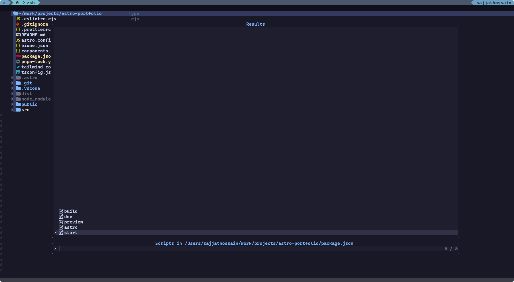
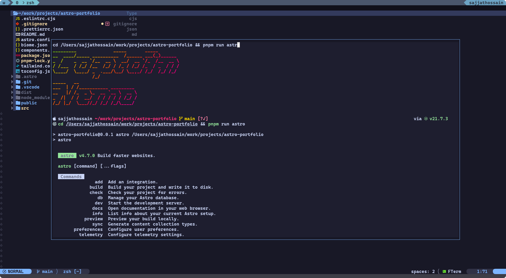

<h1 align="center">Nvim NPM</h1>

<p align="center">A Neovim plugin for JavaScript, TypeScript projects. It provides a way to execute npm scripts without leaving the editor.</p>

<p align="center">
  <a href="##features">Features</a> •
  <a href="##screenshots">Screenshots</a> •
  <a href="##installation">Installation</a> •
  <a href="##commands">Commands</a> •
  <a href="##mappings">Mappings</a> •
  <a href="##configuration">Configuration</a> •
</p>

## Features
 Execute npm scripts without leaving the editor 

## Screenshots
- Search scripts in the project


- Show scripts in a telescope window


- execute script


## Installation

Install the plugin with your favorite package manager:

- [vim-plug](https://github.com/junegunn/vim-plug)

```vim
Plug 'sajjahossain/nvim-npm'
Plug 'numToStr/FTerm.nvim'
Plug 'nvim-telescope/telescope.nvim'
Plug 'rcarriga/nvim-notify'
```

- [packer.nvim](https://github.com/wbthomason/packer.nvim)

```lua
use 'sajjahossain/nvim-npm'
use 'numToStr/FTerm.nvim'
use 'nvim-telescope/telescope.nvim'
use 'rcarriga/nvim-notify'
```

- [lazy.nvim](https://github.com/folke/lazy.nvim)

```lua
require('lazy').setup({
  {
    'sajjahossain/nvim-npm',
    config = true,
    dependencies = {
      'nvim-telescope/telescope.nvim',
      'numToStr/FTerm.nvim',
      'rcarriga/nvim-notify',
    }
  }
})
```

### Commands

| Command | Description |
| --- | --- |
| `:ShowScriptsInTelescope` | Shows the available scripts in a telescope window |
| `:RefreshPackageJsonCache` | Refreshes the package.json cache |

### Mappings

| Mode | Key | Action |
| --- | --- | --- |
| Normal | `;pl` | Lists the available scripts |
| Normal | `;pr` | Refreshes the package.json cache |

## Configuration

You can configure the plugin by setting the following options:

```lua
require('nvim-npm').setup({
    mappings = { -- key mappings [optional]
        t = {}, -- terminal mode mappings
        n = {} -- normal mode mappings
    }
})
```
